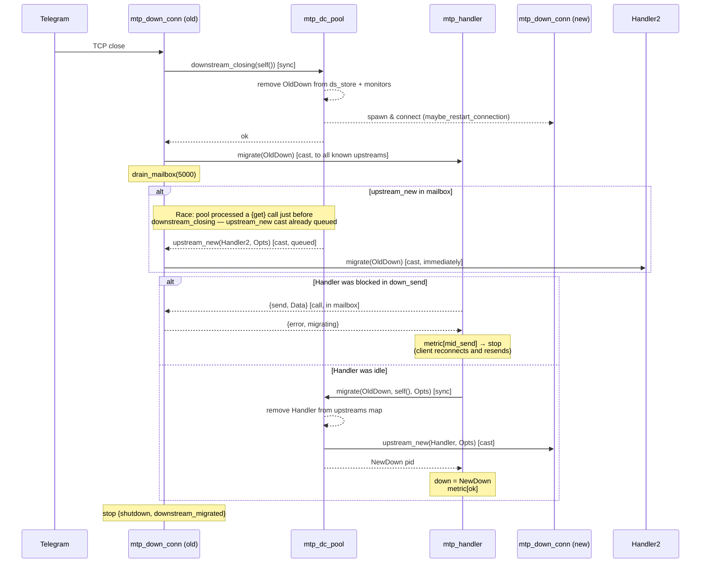

# Transparent client migration on DC connection death

Telegram periodically closes the TCP connection to the proxy ("DC connection
rotation", typically every 30–70 s). Instead of dropping all clients
multiplexed on that connection, the proxy remaps each idle client to a
surviving (or freshly-started) DC connection transparently.

**Key actors:**
- `mtp_down_conn (old)` — the dying downstream connection process
- `mtp_dc_pool` — pool managing all downstream connections for one DC
- `mtp_handler` — one process per connected Telegram client
- `mtp_down_conn (new)` — replacement downstream spawned by the pool

